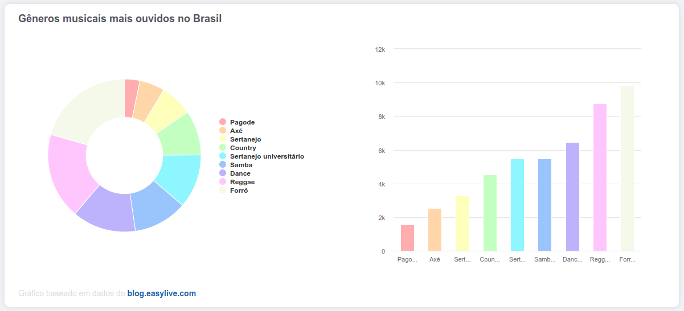

# Dashboard




> Dashboard simples, mostrando os gêneros musicais mais ouvidos no Brasil, feito em <a href="https://angular.io/">🔗 Angular</a> usando os gráficos do <a href="https://www.highcharts.com">🔗 Highcharts.

## 🚀 Instalando Dashboard

Para instalar o dashbpoard, siga estas etapas:

Linux, macOS e Windows:
```
yarn install
```
```
ng serve
```

## 📫 Contribuindo para dashboard  

Para contribuir com o dashboard, siga estas etapas:

1. Bifurque este repositório.
2. Crie um branch: `git checkout -b <nome_branch>`.
3. Faça suas alterações e confirme-as: `git commit -m '<mensagem_commit>'`
4. Envie para o branch original: `git push origin dashboard / <local>`
5. Crie a solicitação de pull.

## 🤝 Colaboradores

<table>
  <tr>
    <td align="center">
      <a href="#">
        <br>
        <sub>
          <b>Madalena Campos</b>
        </sub>
      </a>
    </td>
  </tr>
</table>

[⬆ Voltar ao topo](#calculadora)<br>
